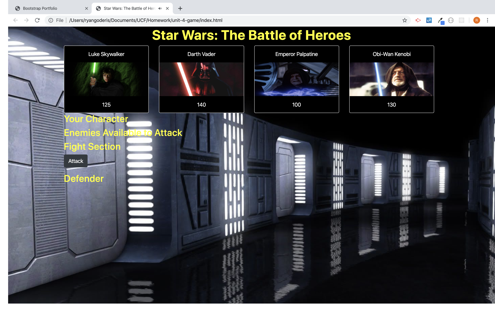
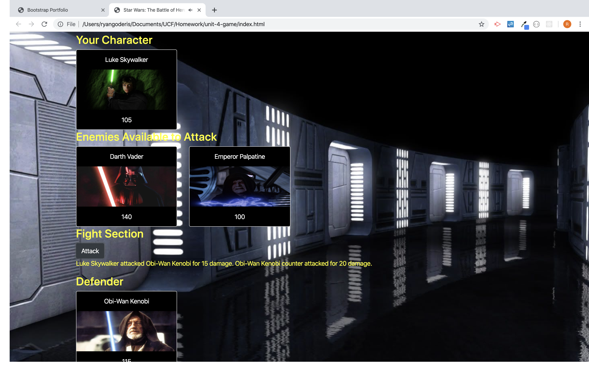
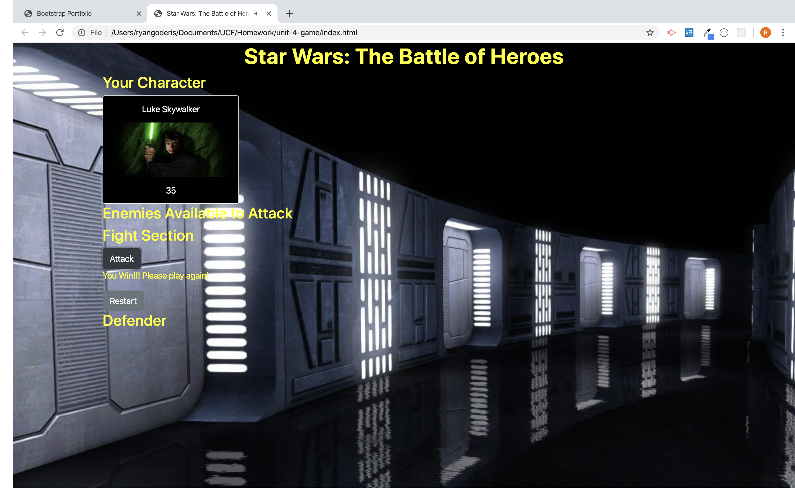

# Star Wars RPG
Star Wars RPG is a JavaScript application that allows the user to choose a character and fight that character against other enemies.  Each character has different HP, attack, and counter attack statistics so the player can win or lose with any character depending on which order of enemies they fight.  

The game utilized jQuery for DOM manipulation and JavaScript functions to calculate hp and attack as well as selecting the selected character and enemy.

### Start Screen

### Combat

### Victory

[Star Wars RPG](https://rgoderis.github.io/StarWars-RPG/)